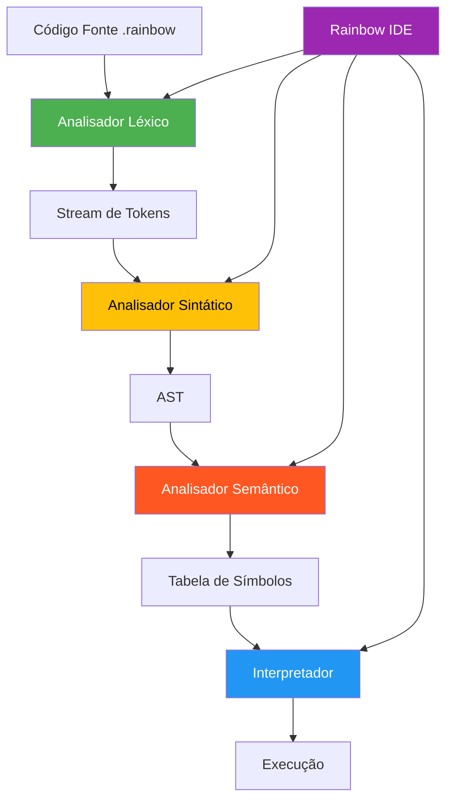

# 🌈 Rainbow IDE & Compilador

<div align="center">


Uma IDE completa e compilador para a linguagem de programação Rainbow, desenvolvido para fins educacionais.

**🎓 Projeto Acadêmico - Disciplina de Compiladores**
*IFSULDEMINAS Campus Muzambinho | Professor: Hudson*

</div>

## 📋 Sobre o Projeto

O Rainbow IDE é um ambiente de desenvolvimento integrado completo para a linguagem Rainbow, uma linguagem de programação com sintaxe em português projetada para fins didáticos e educacionais.

### 🎯 Objetivos

- Implementar todas as fases de um compilador educacional
- Criar uma IDE moderna e intuitiva para desenvolvimento
- Demonstrar conceitos de compilação de forma prática
- Fornecer interpretador integrado para execução de programas
- Facilitar o aprendizado de programação em português

### 📊 Status do Desenvolvimento

| Componente | Status | Descrição |
|------------|--------|-----------|
| **Rainbow IDE** | ✅ **Completo** | Interface gráfica moderna com temas |
| **Análise Léxica** | ✅ **Completo** | Tokenização com detecção de erros |
| **Análise Sintática** | ✅ **Completo** | Parser com construção de AST |
| **Análise Semântica** | ✅ **Completo** | Verificação de tipos e escopo |
| **Interpretador** | ✅ **Completo** | Execução interativa de programas |
| **Exemplos** | ✅ **Completo** | 7 programas demonstrativos |

## 🚀 Começando

### Pré-requisitos

- Python 3.10 ou superior
- Tkinter (geralmente incluído com Python)

### Instalação

1. Clone o repositório:
```bash
git clone https://github.com/anderson-ufrj/compilers-rainbow_language
cd compilers-rainbow_language
```

2. Execute a Rainbow IDE:
```bash
python3 main.py
# ou
./run.sh  # (no Linux/macOS)
```

## 💻 Usando a Rainbow IDE

### 🖥️ Interface Principal

A Rainbow IDE oferece uma experiência moderna de desenvolvimento:

- **Editor com Syntax Highlighting** - Cores automáticas para código Rainbow
- **Sistema de Temas** - Modo claro e escuro (menu Visualizar → Tema)
- **Análise em Tempo Real** - Validação léxica, sintática e semântica
- **Interpretador Integrado** - Execute programas diretamente na IDE
- **Console Interativo** - Entrada e saída em tempo real
- **Exemplos Inclusos** - 7 programas prontos para aprender

### ⚡ Funcionalidades Principais

| Funcionalidade | Atalho | Descrição |
|----------------|--------|-----------|
| **Executar Programa** | `Ctrl+R` ou ▶️ | Executa o código atual |
| **Novo Arquivo** | `Ctrl+N` | Cria novo arquivo Rainbow |
| **Abrir Arquivo** | `Ctrl+O` | Abre arquivo .rainbow |
| **Salvar** | `Ctrl+S` | Salva arquivo atual |
| **Análise Léxica** | `F5` | Apenas análise léxica |
| **Análise Sintática** | `F6` | Análise léxica + sintática |
| **Análise Semântica** | `F7` | Análise completa |
| **Compilação Completa** | `F8` | Todas as análises |

### 📚 Exemplos Inclusos

Acesse via menu **Exemplos**:

1. **👋 Olá Mundo** - Primeiro programa Rainbow
2. **🧮 Calculadora** - Operações matemáticas básicas
3. **📊 Tabuada** - Laços de repetição
4. **🔀 Condicional** - Estruturas se/senao aninhadas
5. **🔄 Laço Para** - Diferentes tipos de loops
6. **🏷️ Tipos de Dados** - Demonstração de tipos
7. **💬 Entrada do Usuário** - Interação com usuário

## 🌟 Linguagem Rainbow

### Estrutura Básica

Todo programa Rainbow deve começar com:
```rainbow
RAINBOW.
```

### Variáveis

As variáveis são prefixadas com `#`:
```rainbow
#nome recebe "João".
#idade recebe 25.
#ativo recebe Verdadeiro.
```

### Tipos de Dados

- **NUMERO** - Inteiros e decimais (42, 3.14)
- **TEXTO** - Strings ("Olá mundo")
- **LOGICO** - Booleanos (Verdadeiro, Falso)
- **LISTA** - Arrays de elementos

### Entrada/Saída

```rainbow
#nome recebe ler("Digite seu nome: ").
mostrar("Olá, " + #nome + "!").
```

### Estruturas de Controle

**Condicionais:**
```rainbow
se (#idade >= 18) {
    mostrar("Maior de idade").
} senao {
    mostrar("Menor de idade").
}
```

**Loops:**
```rainbow
// Laço para com contador
para #i de 1 ate 10 passo 1 {
    mostrar(#i).
}

// Laço enquanto
enquanto (#contador < 10) {
    #contador recebe #contador + 1.
}
```

### Operadores

- **Aritméticos**: `+`, `-`, `*`, `/`, `%`
- **Relacionais**: `>`, `<`, `>=`, `<=`, `igual`, `diferente`
- **Lógicos**: `E`, `OU`, `NAO`
- **Atribuição**: `recebe`

## 🏗️ Arquitetura

### Componentes do Sistema



### Estrutura de Arquivos

```
compilers-rainbow_language/
├── main.py                    # Rainbow IDE (interface principal)
├── run.sh                     # Script de execução
├── src/
│   ├── analisador_lexico.py      # Análise léxica
│   ├── analisador_sintatico.py   # Análise sintática
│   ├── analisador_semantico.py   # Análise semântica
│   ├── interpretador_rainbow.py  # Interpretador
│   └── compilador_rainbow.py     # Integrador principal
├── exemplos/
│   ├── ola_mundo.rainbow         # Exemplo básico
│   ├── calculadora.rainbow       # Operações matemáticas
│   ├── tabuada.rainbow           # Laços de repetição
│   ├── condicional.rainbow       # Estruturas condicionais
│   ├── laco_para.rainbow         # Laços para
│   ├── tipos_dados.rainbow       # Tipos de dados
│   └── entrada_usuario.rainbow   # Entrada interativa
├── tests/
│   ├── teste1.rainbow            # Programa válido
│   ├── teste2.rainbow            # Detecção de erros
│   └── teste3.rainbow            # Teste completo
└── docs/
    └── [documentação técnica]
```

## 👨‍💻 Desenvolvedores

**Projeto desenvolvido para a disciplina de Compiladores**

- **👤 Anderson Henrique da Silva**
- **👤 Lurian Letícia dos Reis**

**📚 Orientação**
- **Professor:** Hudson
- **Instituição:** IFSULDEMINAS Campus Muzambinho

## 🛠️ Desenvolvimento

### Tecnologias Utilizadas

- **Python 3.10+** - Linguagem principal
- **Tkinter** - Interface gráfica
- **Threading** - Execução assíncrona
- **JSON** - Saída estruturada
- **RegEx** - Análise de padrões

### Características Técnicas

#### Analisador Léxico
- Tokenização caractere por caractere
- Recuperação automática de erros
- Rastreamento preciso de posição
- 30+ tipos de tokens

#### Analisador Sintático
- Parser recursivo descendente
- Construção de AST completa
- Detecção de erros sintáticos
- Recuperação de erros

#### Analisador Semântico
- Tabela de símbolos hierárquica
- Verificação de tipos
- Análise de escopo (GLOBAL, BLOCO, LACO)
- Detecção de variáveis não declaradas

#### Interpretador
- Execução linha por linha
- Suporte a entrada interativa
- Operações matemáticas e lógicas
- Estruturas de controle completas

## 📖 Exemplos de Uso

### Programa Interativo Completo

```rainbow
RAINBOW.

// Programa de cadastro simples
#nome recebe ler("Digite seu nome: ").
#idade recebe ler("Digite sua idade: ").

mostrar("").
mostrar("=== DADOS CADASTRAIS ===").
mostrar("Nome: " + #nome).
mostrar("Idade: " + #idade).

se (#idade >= 18) {
    mostrar(#nome + " é maior de idade!").
} senao {
    mostrar(#nome + " é menor de idade.").
}

mostrar("Cadastro finalizado! 🌈").
```

### Calculadora de Tabuada

```rainbow
RAINBOW.

#numero recebe 5.
#i recebe 1.

mostrar("Tabuada do " + #numero + ":").

enquanto (#i <= 10) {
    #resultado recebe #numero * #i.
    mostrar(#numero + " x " + #i + " = " + #resultado).
    #i recebe #i + 1.
}
```

## 🚀 Como Usar

1. **Abra a Rainbow IDE:**
   ```bash
   python3 main.py
   ```

2. **Escolha um exemplo** no menu "Exemplos" ou crie um novo arquivo

3. **Execute o programa** com `Ctrl+R` ou clique em ▶️

4. **Digite valores** quando solicitado nas caixas de diálogo

5. **Veja a saída** no console integrado

## 🤝 Agradecimentos

- **Professor Hudson** - Orientação e ensino de compiladores
- **IFSULDEMINAS** - Infraestrutura e suporte acadêmico
- **[Claude Code](https://claude.ai/code)** - IA assistente no desenvolvimento
- **Comunidade Python** - Ferramentas e bibliotecas

## 📞 Contato

Para dúvidas sobre o projeto educacional, entre em contato através das issues do GitHub ou com os desenvolvedores.

---

<div align="center">

**Desenvolvido com 💜 para aprendizado de compiladores**

*Rainbow IDE - Onde o código ganha cores! 🌈*

</div>