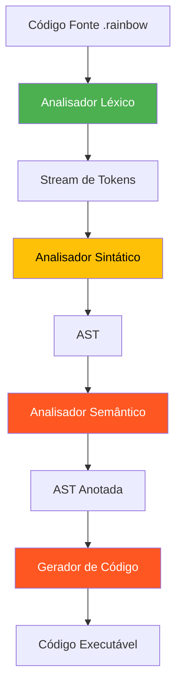

# 🌈 Compilador Rainbow

<div align="center">


Um compilador educacional para a linguagem Rainbow, uma linguagem de programação em português projetada para fins didáticos.

</div>

## 📋 Sobre o Projeto

O Compilador Rainbow é um projeto acadêmico que implementa as fases de compilação para a linguagem Rainbow.
### 🎯 Objetivos

- Criar um compilador didático completo para ensino de compiladores
- Implementar uma linguagem de programação com sintaxe em português
- Demonstrar as fases clássicas de compilação
- Fornecer mensagens de erro claras e educativas

### 📊 Status do Desenvolvimento

| Fase | Status | Descrição |
|------|--------|-----------|
| Análise Léxica | ✅ Completo | Scanner implementado e testado |
| Análise Sintática | 🚧 Planejado | Parser para construção da AST |
| Análise Semântica | 📅 Futuro | Verificação de tipos e escopo |
| Geração de Código | 📅 Futuro | Geração de código intermediário |
| Interface Gráfica | 📅 Futuro | GUI em Tkinter |

## 🚀 Começando

### Pré-requisitos

- Python 3.10 ou superior
- Terminal/Console para execução

### Instalação

1. Clone o repositório:
```bash
git clone [url-do-repositorio]
cd compilers-rainbow_language
```

2. Execute o analisador léxico:
```bash
python3 src/analisador_lexico.py
```

## 💻 Uso

### Análise Léxica

Para analisar um arquivo `.rainbow`:

```bash
python3 src/analisador_lexico.py arquivo.rainbow
```

Para modo interativo (digite código Rainbow diretamente):

```bash
python3 src/analisador_lexico.py
```

### Arquivos de Teste

O projeto inclui três arquivos de teste cuidadosamente elaborados:

| Arquivo | Propósito | Características |
|---------|-----------|-----------------|
| `tests/teste1.rainbow` | Validação básica | I/O, condicionais, loops |
| `tests/teste2.rainbow` | Detecção de erros | Erros léxicos intencionais |
| `tests/teste3.rainbow` | Teste completo | Todos os tokens e operadores |

### Executando os Testes

```bash
# Testar programa válido
python3 src/analisador_lexico.py tests/teste1.rainbow

# Testar detecção de erros
python3 src/analisador_lexico.py tests/teste2.rainbow

# Testar funcionalidades completas
python3 src/analisador_lexico.py tests/teste3.rainbow
```

## 🌟 Linguagem Rainbow

A Rainbow é uma linguagem de programação educacional com sintaxe completamente em português, projetada para facilitar o aprendizado de programação para falantes nativos da língua portuguesa.

### Estrutura Básica

Todo programa Rainbow deve começar com:
```rainbow
RAINBOW.
```

### Variáveis

As variáveis são prefixadas com `#`:
```rainbow
#nome recebe "João".
#idade recebe 25.
```

### Tipos de Dados

- `cor_numero` - Números inteiros e reais
- `cor_texto` - Strings de texto
- `cor_logico` - Valores booleanos (Verdadeiro/Falso)
- `cor_lista` - Listas de elementos

### Entrada/Saída

```rainbow
#nome recebe ler("Digite seu nome: ").
mostrar("Olá, " + #nome + "!").
```

### Estruturas de Controle

**Condicionais:**
```rainbow
se (#idade >= 18) {
    mostrar("Maior de idade").
} senao {
    mostrar("Menor de idade").
}
```

**Loops:**
```rainbow
para #i de 1 ate 10 passo 1 {
    mostrar(#i).
}

enquanto (#contador < 10) {
    #contador recebe #contador + 1.
}
```

### Operadores

- **Aritméticos**: `+`, `-`, `*`, `/`, `%`
- **Relacionais**: `>`, `<`, `>=`, `<=`, `igual`, `diferente`
- **Lógicos**: `E`, `OU`, `NAO`
- **Atribuição**: `recebe`

### Comentários

```rainbow
// Este é um comentário de linha
```

## 🏗️ Arquitetura

### Componentes Principais



### Estrutura do Analisador Léxico

```python
src/analisador_lexico.py
├── TokenType (Enum)           # 30+ tipos de tokens definidos
├── Token (Class)              # Estrutura: tipo, lexema, linha, coluna
├── AnalisadorLexico (Class)   # Scanner com detecção de erros
│   ├── __init__()            # Inicialização e criação de arquivos teste
│   ├── analisar()            # Loop principal de análise
│   ├── processar_*()         # Métodos especializados por tipo
│   └── adicionar_erro()      # Sistema de recuperação de erros
└── main()                    # CLI interativa
```

### Características Técnicas

- **Análise caractere por caractere** com lookahead
- **Recuperação de erros** - continua análise após erros
- **Rastreamento preciso** de linha e coluna
- **Validação contextual** de tokens
- **Limites configuráveis** para identificadores e números

## 📁 Estrutura do Projeto

```
compilers-rainbow_language/
├── src/
│   └── analisador_lexico.py
├── tests/
│   ├── teste1.rainbow
│   ├── teste2.rainbow
│   └── teste3.rainbow
├── docs/
│   ├── Requisitos Técnicos.md
│   └── 🌈Rainbow✨ - Compiladores.pdf
├── CLAUDE.md
├── README.md
└── .gitignore
```

## 🛠️ Desenvolvimento

### Ferramentas e Tecnologias

- **Linguagem**: Python 3.10+
- **IDE Recomendada**: PyCharm, VS Code
- **IA Assistant**: [Claude Code](https://claude.ai/code) - Utilizado para acelerar desenvolvimento e garantir qualidade
- **Controle de Versão**: Git

### Roadmap

#### Fase 1: Análise Léxica ✅
- [x] Implementar tokenização básica
- [x] Adicionar detecção de erros léxicos
- [x] Criar sistema de recuperação de erros
- [x] Implementar todos os tokens da linguagem

#### Fase 2: Análise Sintática 🚧
- [ ] Definir gramática formal
- [ ] Implementar parser recursivo descendente
- [ ] Construir AST (Abstract Syntax Tree)
- [ ] Adicionar recuperação de erros sintáticos

#### Fase 3: Análise Semântica 📅
- [ ] Implementar tabela de símbolos
- [ ] Adicionar verificação de tipos
- [ ] Validar declarações e escopo
- [ ] Detectar uso de variáveis não declaradas

#### Fase 4: Interface Gráfica 📅
- [ ] Criar GUI com Tkinter
- [ ] Adicionar editor com syntax highlighting
- [ ] Implementar visualização de tokens
- [ ] Mostrar árvore sintática

### Como Contribuir

1. **Fork** o projeto
2. Crie uma **branch** para sua feature (`git checkout -b feature/NovaFuncionalidade`)
3. **Commit** suas mudanças (`git commit -m 'feat: adiciona nova funcionalidade'`)
4. **Push** para a branch (`git push origin feature/NovaFuncionalidade`)
5. Abra um **Pull Request**

### Padrões de Código

- **Nomenclatura**: Snake_case para funções e variáveis
- **Documentação**: Docstrings em português
- **Commits**: Seguir [Conventional Commits](https://www.conventionalcommits.org/)
- **Testes**: Adicionar casos de teste para novas funcionalidades

## 📚 Documentação

### Documentos Disponíveis

- **[Requisitos Técnicos](docs/Requisitos%20Técnicos.md)** - Especificações detalhadas do projeto
- **[Documentação Rainbow](docs/)** - PDFs com especificação da linguagem
- **[CLAUDE.md](CLAUDE.md)** - Guia para desenvolvimento com Claude Code

### Exemplos de Código

<details>
<summary>📝 Exemplo: Calculadora de Tabuada</summary>

```rainbow
RAINBOW.

// Programa para calcular tabuada
#numero recebe ler("Digite um número: ").
mostrar("Tabuada do " + #numero + ":").

para #i de 1 ate 10 passo 1 {
    #resultado recebe #numero * #i.
    mostrar(#numero + " x " + #i + " = " + #resultado).
}
```
</details>

<details>
<summary>🎮 Exemplo: Jogo de Adivinhação</summary>

```rainbow
RAINBOW.

#secreto recebe 42.
#tentativa recebe 0.
#acertou recebe Falso.

enquanto (#acertou igual Falso) {
    #tentativa recebe ler("Adivinhe o número: ").
    
    se (#tentativa igual #secreto) {
        mostrar("Parabéns! Você acertou!").
        #acertou recebe Verdadeiro.
    } senaose (#tentativa > #secreto) {
        mostrar("Muito alto! Tente novamente.").
    } senao {
        mostrar("Muito baixo! Tente novamente.").
    }
}
```
</details>

## 🤝 Agradecimentos

- **Professor(a)** da disciplina de Compiladores
- **[Claude Code](https://claude.ai/code)** - IA assistente no desenvolvimento
- **Comunidade Python** - Ferramentas e bibliotecas

## 📞 Contato

Para dúvidas sobre o projeto, consulte a documentação ou entre em contato através das issues do GitHub.

## 📈 Estatísticas do Projeto


---

<div align="center">

**Desenvolvido com 💜 para aprendizado de compiladores**


</div>
