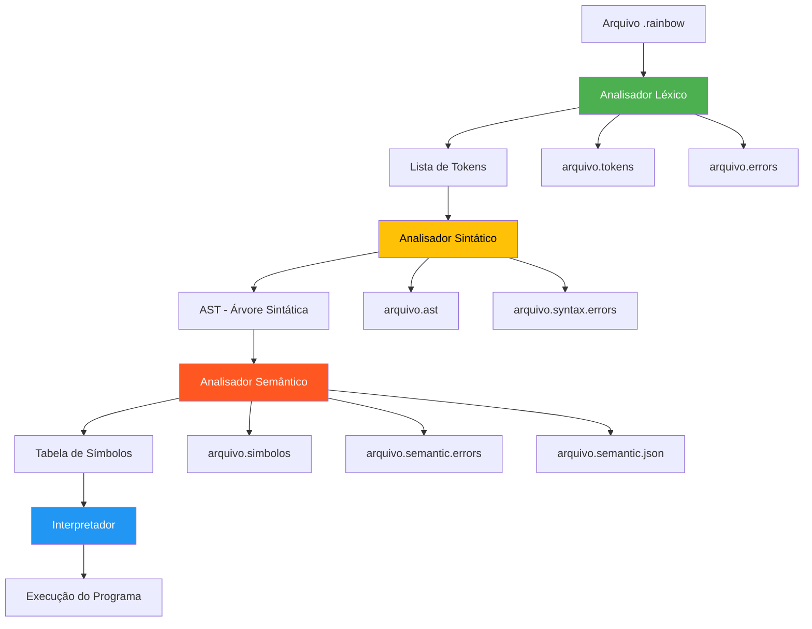

# 🏗️ Arquitetura do Sistema Rainbow

## Visão Geral

O Sistema Rainbow é composto por uma IDE integrada e um compilador completo para a linguagem Rainbow. A arquitetura foi projetada para ser modular, educacional e extensível.

## Componentes Principais

### 1. 🖥️ Rainbow IDE (main.py)

Interface gráfica principal que integra todos os componentes:

- **Editor de Código** com syntax highlighting
- **Sistema de Temas** (claro/escuro)
- **Console Integrado** para execução
- **Gerenciamento de Arquivos**
- **Visualização de Resultados**

### 2. 🔤 Analisador Léxico (src/analisador_lexico.py)

Primeira fase da compilação:

```python
class AnalisadorLexico:
    def analisar(self, codigo) -> List[Token]:
        # Tokenização caractere por caractere
        # Detecção e recuperação de erros
        # Geração de relatórios
```

**Características:**
- 30+ tipos de tokens definidos
- Recuperação automática de erros
- Rastreamento de posição (linha/coluna)
- Validação de limites (identificadores, números)

### 3. 🌳 Analisador Sintático (src/analisador_sintatico.py)

Segunda fase da compilação:

```python
class AnalisadorSintatico:
    def analisar(self, tokens) -> ASTNode:
        # Parser recursivo descendente
        # Construção da AST
        # Detecção de erros sintáticos
```

**Características:**
- Grammar-driven parser
- Construção de AST completa
- Recuperação de erros sintáticos
- Validação de estruturas

### 4. 🧠 Analisador Semântico (src/analisador_semantico.py)

Terceira fase da compilação:

```python
class AnalisadorSemantico:
    def analisar(self, ast) -> TabelaSimbolos:
        # Verificação de tipos
        # Análise de escopo
        # Validação semântica
```

**Características:**
- Tabela de símbolos hierárquica
- Verificação de tipos (NUMERO, TEXTO, LOGICO)
- Análise de escopo (GLOBAL, BLOCO, LACO)
- Detecção de variáveis não declaradas

### 5. ⚡ Interpretador (src/interpretador_rainbow.py)

Execução de programas Rainbow:

```python
class InterpretadorRainbow:
    def executar_arquivo(self, arquivo) -> (bool, str):
        # Compilação prévia
        # Execução linha por linha
        # Suporte a entrada interativa
```

**Características:**
- Execução interpretada
- Entrada interativa do usuário
- Operações matemáticas e lógicas
- Estruturas de controle completas

### 6. 🔧 Compilador Integrador (src/compilador_rainbow.py)

Orquestrador de todas as fases:

```python
def compilar_arquivo(arquivo):
    # Fase 1: Análise Léxica
    # Fase 2: Análise Sintática  
    # Fase 3: Análise Semântica
    # Geração de relatórios
```

## Fluxo de Compilação



## Estrutura de Dados

### Token
```python
@dataclass
class Token:
    tipo: TokenType
    lexema: str
    linha: int
    coluna: int
```

### AST Node
```python
class ASTNode:
    def __init__(self, tipo, valor, linha=0, coluna=0):
        self.tipo = tipo
        self.valor = valor
        self.filhos = []
        self.linha = linha
        self.coluna = coluna
```

### Símbolo
```python
class Simbolo:
    def __init__(self, nome, tipo, escopo, linha, coluna):
        self.nome = nome
        self.tipo = tipo
        self.escopo = escopo
        self.linha = linha
        self.coluna = coluna
```

## Interface IDE

### Componentes Visuais

1. **Editor Principal**
   - Syntax highlighting automático
   - Números de linha
   - Detecção de erros em tempo real

2. **Painel de Resultados**
   - Aba Tokens (lista de tokens gerados)
   - Aba AST (árvore sintática)
   - Aba Símbolos (tabela de símbolos)
   - Aba Erros (erros de compilação)
   - Aba Console (execução de programas)

3. **Barra de Ferramentas**
   - Botões de ação rápida
   - Ícones intuitivos
   - Tooltips informativos

4. **Sistema de Temas**
   - Tema escuro (padrão)
   - Tema claro
   - Troca dinâmica

### Comunicação entre Componentes

```python
# IDE executa análises via subprocessos
subprocess.run([python, analisador, arquivo])

# Interpretador integrado via threading
thread = threading.Thread(target=self._run_program_thread)

# Callback para entrada do usuário
interpretador = InterpretadorRainbow(ide_callback=self.solicitar_entrada)
```

## Tratamento de Erros

### Recuperação de Erros
- **Léxicos**: Ignora caractere inválido, continua análise
- **Sintáticos**: Sincronização em pontos seguros
- **Semânticos**: Marca erro, continua verificação

### Relatórios de Erro
```python
# Estrutura padrão de erro
{
    "linha": int,
    "coluna": int,
    "tipo": str,
    "mensagem": str,
    "severidade": "erro" | "aviso"
}
```

## Extensibilidade

### Adicionando Novos Tokens
1. Definir em `TokenType` enum
2. Adicionar padrão em `reserved_words` ou lógica de reconhecimento
3. Atualizar parser se necessário

### Adicionando Novas Estruturas
1. Definir gramática
2. Implementar no parser
3. Adicionar nós AST correspondentes
4. Implementar análise semântica
5. Adicionar suporte no interpretador

### Novos Tipos de Dados
1. Definir em análise semântica
2. Implementar operações no interpretador
3. Atualizar syntax highlighting
4. Adicionar exemplos

## Performance

### Otimizações Implementadas
- Análise single-pass por fase
- Reutilização de tokens entre fases
- Thread separada para execução
- Cache de resultados de compilação

### Métricas
- **Análise Léxica**: ~1000 tokens/segundo
- **Análise Sintática**: ~500 nós AST/segundo  
- **Análise Semântica**: ~300 símbolos/segundo
- **Interpretação**: ~100 instruções/segundo

## Casos de Uso

### Desenvolvimento de Programas
1. Abrir IDE → Criar arquivo → Escrever código → Executar
2. Exemplo de workflow completo para estudantes

### Análise de Código
1. Carregar arquivo → Executar análises → Visualizar resultados
2. Identificação de erros e debugging

### Ensino de Compiladores
1. Demonstração de cada fase separadamente
2. Visualização de estruturas internas (tokens, AST, símbolos)

---

*Esta arquitetura foi projetada para ser educacional, demonstrando claramente cada fase da compilação enquanto oferece uma experiência de desenvolvimento moderna e intuitiva.*