# ⚡ Interpretador Rainbow

## Introdução

O Interpretador Rainbow é um componente-chave do sistema que permite a execução direta de programas Rainbow sem necessidade de compilação para código de máquina. Ele interpreta o código fonte linha por linha, oferecendo execução interativa e feedback imediato.

## Características Principais

### 🔄 Execução Interpretada
- Execução linha por linha do código fonte
- Não gera código intermediário
- Feedback imediato de erros
- Ideal para prototipagem e aprendizado

### 💬 Interatividade
- Suporte a entrada do usuário via `ler()`
- Diálogos gráficos na IDE
- Console integrado para saída
- Execução assíncrona (não trava a interface)

### 🛡️ Robustez
- Verificação prévia de compilação
- Tratamento de erros em tempo de execução
- Recuperação graceful de falhas
- Limitações de segurança (prevenção de loops infinitos)

## Arquitetura do Interpretador

### Estrutura da Classe Principal

```python
class InterpretadorRainbow:
    def __init__(self, ide_callback=None):
        self.variaveis = {}           # Espaço de variáveis
        self.ide_callback = ide_callback  # Callback para entrada
        self.output = []              # Buffer de saída
        
    def executar_arquivo(self, arquivo_path):
        # 1. Verificar compilação
        # 2. Carregar código fonte
        # 3. Executar linha por linha
        
    def executar_codigo(self, codigo):
        # Parser simples e execução direta
```

### Fluxo de Execução

```mermaid
graph TD
    A[Arquivo .rainbow] --> B[Verificar Compilação]
    B -->|Sucesso| C[Carregar Código]
    B -->|Erro| Z[Retornar Erro]
    C --> D[Dividir em Linhas]
    D --> E[Loop Principal]
    E --> F[Processar Linha]
    F --> G{Tipo de Comando}
    
    G -->|Atribuição| H[Executar Atribuição]
    G -->|Mostrar| I[Executar Saída]
    G -->|Se/Senão| J[Estrutura Condicional]
    G -->|Enquanto| K[Laço While]
    G -->|Para| L[Laço For]
    
    H --> M[Próxima Linha]
    I --> M
    J --> M
    K --> M
    L --> M
    
    M --> N{Fim do Código?}
    N -->|Não| E
    N -->|Sim| O[Retornar Resultado]
    
    style B fill:#FFC107,color:#000
    style F fill:#4CAF50,color:#fff
    style O fill:#2196F3,color:#fff
```



## Componentes Detalhados

### 1. Verificação de Compilação

```python
def compilar_arquivo(self, arquivo_path):
    """Verifica se arquivo compila sem erros críticos"""
    # Executa analisadores léxico e sintático
    # Permite erros semânticos menores
    # Retorna True se executável
```

**Critérios de Aceitação:**
- ✅ Sem erros léxicos
- ✅ Sem erros sintáticos 
- ⚠️ Erros semânticos permitidos (conversão automática)

### 2. Processamento de Linhas

```python
def executar_linha(self, linha, linhas, indice):
    """Executa comando específico"""
    linha = linha.rstrip('.')  # Remove ponto final
    
    if 'recebe' in linha:
        self.executar_atribuicao(linha)
    elif linha.startswith('mostrar('):
        self.executar_mostrar(linha)
    elif linha.startswith('se ('):
        return self.executar_se(linha, linhas, indice)
    # ... outros comandos
```

### 3. Avaliação de Expressões

```python
def avaliar_expressao(self, expressao):
    """Avalia expressões matemáticas e lógicas"""
    # Strings literais: "texto"
    # Números: 42, 3.14
    # Booleanos: Verdadeiro, Falso
    # Variáveis: #nome
    # Função ler: ler("prompt")
    # Operações: +, -, *, /, %, >, <, >=, <=, E, OU, NAO
```

## Tipos de Dados Suportados

### Tipos Primitivos

| Tipo | Descrição | Exemplos |
|------|-----------|----------|
| **NUMERO** | Inteiros e decimais | `42`, `3.14`, `-10` |
| **TEXTO** | Strings de caracteres | `"Olá"`, `"mundo"` |
| **LOGICO** | Valores booleanos | `Verdadeiro`, `Falso` |

### Conversões Automáticas

```python
# Concatenação automática
"Idade: " + 25 → "Idade: 25"

# Conversão para números em operações
"18" >= 18 → True (string convertida para número)

# Comparações inteligentes
"25" - 5 → 20 (conversão automática)
```

## Estruturas de Controle

### 1. Estruturas Condicionais

```rainbow
se (#idade >= 18) {
    mostrar("Maior de idade").
} senao {
    mostrar("Menor de idade").
}
```

**Implementação:**
```python
def executar_se(self, linha, linhas, indice):
    # 1. Extrair condição: (#idade >= 18)
    # 2. Avaliar expressão booleana
    # 3. Encontrar blocos correspondentes
    # 4. Executar bloco apropriado
```

### 2. Laços de Repetição

#### Laço Enquanto
```rainbow
enquanto (#contador < 10) {
    #contador recebe #contador + 1.
    mostrar(#contador).
}
```

#### Laço Para
```rainbow
para #i de 1 ate 10 passo 1 {
    mostrar(#i).
}
```

**Características:**
- Controle automático de variável
- Suporte a passos personalizados
- Prevenção de loops infinitos (máx. 1000 iterações)

## Entrada e Saída

### Função `ler()`

```rainbow
#nome recebe ler("Digite seu nome: ").
```

**Comportamento:**
- Na IDE: Abre diálogo gráfico
- Linha de comando: Input tradicional
- Thread-safe com callback assíncrono

### Função `mostrar()`

```rainbow
mostrar("Olá, " + #nome + "!").
```

**Características:**
- Concatenação automática
- Suporte a qualquer tipo de dado
- Buffer de saída para IDE

## Tratamento de Erros

### Tipos de Erro

| Tipo | Descrição | Ação |
|------|-----------|------|
| **Compilação** | Erro léxico/sintático | Interrompe execução |
| **Runtime** | Erro durante execução | Reporta linha e erro |
| **Tipo** | Operação inválida | Tenta conversão automática |
| **Variável** | Variável não declarada | Erro fatal |

### Exemplo de Tratamento

```python
try:
    resultado = self.avaliar_expressao(expressao)
    self.variaveis[var_nome] = resultado
except Exception as e:
    raise Exception(f"Erro na linha {linha}: {str(e)}")
```

## Limitações e Segurança

### Limitações Intencionais

- **Loops infinitos**: Máximo 1000 iterações
- **Recursão**: Não suportada
- **Arquivos**: Sem acesso ao sistema de arquivos
- **Rede**: Sem operações de rede

### Sandboxing

```python
# Prevenção de loop infinito
max_iteracoes = 1000
iteracoes = 0

while self.avaliar_expressao(condicao) and iteracoes < max_iteracoes:
    # execução do loop
    iteracoes += 1
    
if iteracoes >= max_iteracoes:
    raise Exception("Loop infinito detectado!")
```

## Integração com a IDE

### Comunicação Assíncrona

```python
# Thread principal (IDE)
def run_program(self):
    thread = threading.Thread(target=self._run_program_thread)
    thread.daemon = True
    thread.start()

# Thread do interpretador
def _run_program_thread(self):
    interpretador = InterpretadorRainbow(ide_callback=self.solicitar_entrada)
    sucesso, resultado = interpretador.executar_arquivo(self.current_file)
```

### Callback para Entrada

```python
def solicitar_entrada_usuario(self, prompt):
    # Executa na thread principal
    resultado = [None]
    evento = threading.Event()
    
    def pedir_entrada():
        valor = tk.simpledialog.askstring("Entrada", prompt)
        resultado[0] = valor
        evento.set()
    
    self.root.after(0, pedir_entrada)
    evento.wait()  # Aguardar resposta
    return resultado[0]
```

## Performance

### Benchmarks Típicos

- **Programa simples** (10 linhas): ~10ms
- **Laço 100 iterações**: ~50ms  
- **Operações matemáticas**: ~1ms por operação
- **Entrada do usuário**: Limitado por interação humana

### Otimizações Implementadas

- Cache de variáveis em dicionário Python
- Compilação prévia para validação
- Execução single-threaded (sem overhead de sincronização)
- Avaliação lazy de expressões

## Casos de Uso

### 1. Prototipagem Rápida
```rainbow
RAINBOW.
#resultado recebe 10 * 5.
mostrar("Resultado: " + #resultado).
```

### 2. Programas Interativos
```rainbow
RAINBOW.
#nome recebe ler("Nome: ").
#idade recebe ler("Idade: ").
mostrar("Olá, " + #nome + "! Você tem " + #idade + " anos.").
```

### 3. Algoritmos Educacionais
```rainbow
RAINBOW.
para #i de 1 ate 10 passo 1 {
    se (#i % 2 igual 0) {
        mostrar(#i + " é par").
    } senao {
        mostrar(#i + " é ímpar").
    }
}
```

## Extensões Futuras

### Funcionalidades Planejadas

- **Funções definidas pelo usuário**
- **Arrays/Listas** com indexação
- **Estruturas de dados** (registros)
- **Módulos** e imports
- **Debugging** passo a passo

### Melhorias de Performance

- **JIT compilation** para loops intensivos
- **Otimização de expressões** matemáticas
- **Cache de resultados** para operações repetitivas

---

*O Interpretador Rainbow foi projetado para ser educacional, seguro e fácil de usar, oferecendo uma experiência de programação interativa e amigável para estudantes.*